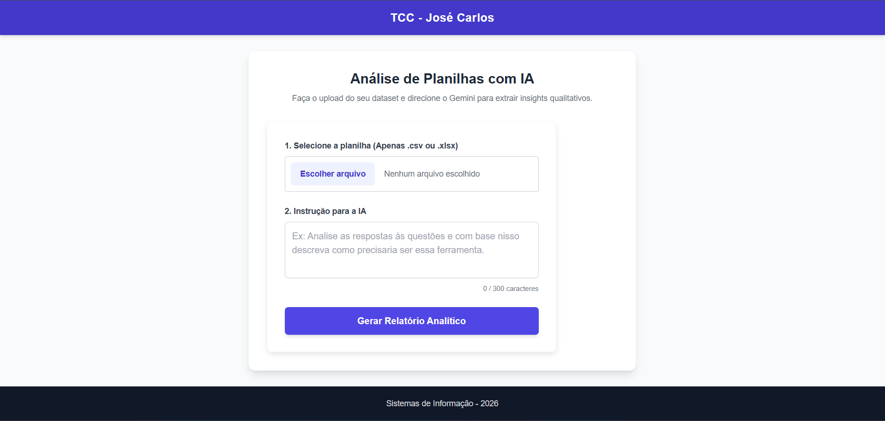

# 📊 Analisador de Dados Python/Gemini

**Trabalho de Conclusão de Curso (TCC)** – Bacharelado em Sistemas de Informação (2026)  
**Autor:** José Carlos Cândido Ferreira  

<div align="center">
  
  
  
  
  
  
</div>

<br>

<div align="center">
  
</div>

---

## 💻 Sobre o Projeto

Este protótipo é uma aplicação web desenvolvida em **Python (Flask)** projetada para otimizar o fluxo de *reporting* e análise na gestão de produtos e serviços. O sistema resolve o desafio da interpretação manual de grandes conjuntos de dados textuais não estruturados, como feedbacks, avaliações e comentários qualitativos.

Através da integração do **Pandas** (para pré-processamento e manipulação de planilhas) com a **API do Google Gemini** (Inteligência Artificial Generativa), a ferramenta lê arquivos `.csv` e `.xlsx`, aplica técnicas rigorosas de Engenharia de Prompt e devolve um relatório analítico estruturado diretamente em uma interface HTML.

### 🛡️ Diferencial Técnico: Mitigação de Alucinações

O código foi arquitetado com travas de segurança rigorosas (RNF02) para garantir que a IA atue de forma puramente analítica e factual.

O sistema utiliza:

1. **Grounding (Ancoragem):** Instruções no prompt que proíbem a invenção de dados.  
2. **Contexto Integral:** Uso da função `to_csv(index=False)` no Pandas para injetar 100% dos dados na memória da IA, evitando cortes na leitura de planilhas extensas.  
3. **Hiperparâmetros Determinísticos:** Chamada da API configurada com `temperature=0.1` para bloquear a criatividade excessiva da rede neural.

---

## 🗂️ Arquitetura de Pastas

O projeto adota o padrão de separação de responsabilidades (MVC adaptado), dividindo rotas, regras de negócio e interfaces visuais:

```text
tcc-jose/
│
├── run.py                 # Arquivo principal que inicializa o servidor web.
├── .env                   # Arquivo oculto de variáveis de ambiente (Chave da API).
├── requirements.txt       # Lista de dependências (Pandas, Flask, google-genai, etc).
├── README.md              # Documentação do projeto.
├── interface.png          # Print da tela principal do sistema.
│
└── app/
    ├── __init__.py        # Inicialização do módulo app.
    ├── routes.py          # Controlador (Controller): gerencia as URLs e rotas web.
    │
    ├── services/
    │   ├── __init__.py        # Identificador do pacote Python.
    │   ├── data_analyzer.py   # Ingestão do Pandas, Data Wrangling e chamada da API.
    │   └── prompt_builder.py  # Isolamento das regras de Engenharia de Prompt.
    │
    ├── templates/
    │   ├── index.html     # Página principal (Upload do arquivo e instrução).
    │   └── resultado.html # Página do relatório final processado pela IA.
    │
    └── static/
        └── css/
            └── style.css  # Folha de estilos padronizada para as telas.
```

---

## 🚀 Como Configurar e Rodar o Projeto

### ✅ Passo 1: Clonar o Repositório

Abra o terminal na pasta onde deseja salvar o projeto e execute os comandos abaixo para baixar o código e entrar na pasta:

```bash
git clone https://github.com/josecarlosjccf/tcc-jose.git
cd tcc-jose
```

---

### ✅ Passo 2: Pré-requisitos

Certifique-se de ter o **Python 3.12.9** instalado em sua máquina para garantir total compatibilidade com as bibliotecas utilizadas.

---

### 📦 Passo 3: Instalação das Dependências

Com o terminal aberto dentro da pasta `tcc-jose`, instale as bibliotecas necessárias executando:

```bash
pip install -r requirements.txt
```

---

### 🔐 Passo 4: Configuração da Chave da API

1. Crie um arquivo novo na raiz do projeto chamado exatamente `.env`.
2. Acesse o [Google AI Studio](https://aistudio.google.com/) e gere uma API Key gratuita.
3. Cole o seguinte conteúdo no arquivo `.env`, substituindo pela sua chave real:

```env
GEMINI_API_KEY="COLE_AQUI_A_SUA_CHAVE_GERADA"
GEMINI_VERSION="2.5"
```

> ⚠️ **Atenção:** O arquivo `.env` está configurado no `.gitignore` e nunca deve ser enviado para o GitHub por questões de segurança.

---

### ▶️ Passo 5: Ligando o Servidor

No terminal, execute o comando abaixo para iniciar a aplicação:

```bash
python run.py
```

Depois acesse no navegador: **http://localhost:5000**

---

## 💡 Como Usar o Sistema na Prática

### 1️⃣ Upload

Na página inicial, clique em "Escolher arquivo" e selecione sua base de dados `.csv` ou `.xlsx`.

### 2️⃣ Instrução (Prompt)

Digite exatamente o que a IA deve investigar.

> *Exemplo: "Leia as avaliações desta planilha e identifique qual é a principal reclamação sobre a entrega"*

### 3️⃣ Análise

Clique em "Gerar Relatório Analítico".

O Python fará a ingestão da planilha e enviará a base completa para a API do Gemini processar.

### 4️⃣ Relatório Executivo

O sistema redirecionará você automaticamente para um Dashboard estruturado em HTML com:

* Resumo Executivo dos Dados  
* Principais Descobertas e Tendências  
* Resposta Direta ao Pedido do Usuário  
* Recomendações e Próximos Passos  