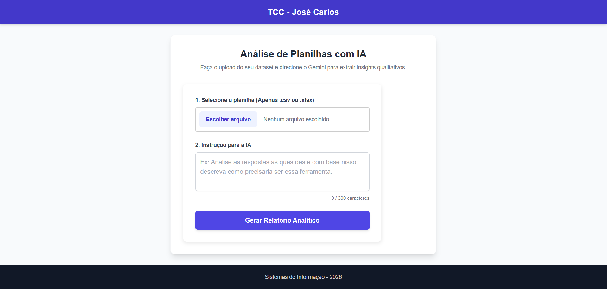

# 📊 Analisador Inteligente de Dados com IA (Python + Gemini)

<p align="center">
  
</p>

<p align="center">
  <b>Trabalho de Conclusão de Curso (TCC)</b><br>
  Bacharelado em Sistemas de Informação – 2026<br>
  <b>Autor:</b> José Carlos Cândido Ferreira
</p>

---

## 🧠 Stack Tecnológica

<div align="center">


<br>


</div>

---

## 🎥 Demonstração da Interface

<p align="center">
  
</p>

> 💡 Dica: você pode gravar um GIF curto da aplicação rodando (com ScreenToGif) e substituir a imagem por um `.gif` animado para deixar ainda mais profissional.

---

# 💻 Sobre o Projeto

O **Analisador Inteligente de Dados** é uma aplicação web desenvolvida com **Python + Flask**, criada para automatizar a interpretação de grandes volumes de dados textuais não estruturados.

O sistema resolve um problema real:

> 🔎 Transformar feedbacks, avaliações e comentários qualitativos em relatórios estratégicos estruturados automaticamente.

A aplicação integra:

- 📊 **Pandas** → Leitura e pré-processamento de `.csv` e `.xlsx`
- 🤖 **Google Gemini API** → Análise com IA Generativa
- 🌐 **HTML + CSS (Tailwind)** → Interface web responsiva

O resultado é um **relatório analítico estruturado em tempo real**, pronto para tomada de decisão.

---

# 🛡️ Diferencial Técnico — Mitigação de Alucinações da IA

Este projeto foi arquitetado com foco em **confiabilidade e precisão analítica**, implementando controles técnicos robustos:

### 🔐 1. Grounding (Ancoragem)

O prompt contém instruções explícitas proibindo a invenção de dados.

### 📄 2. Contexto Integral

Uso de:

```python
df.to_csv(index=False)
```

Garantindo que **100% dos dados** sejam enviados para análise.

### 🎛️ 3. Configuração Determinística

Chamada da API com:

```python
temperature=0.1
```

Reduzindo criatividade e aumentando previsibilidade e consistência.

---

# 🏗️ Arquitetura do Projeto

Organização baseada em **MVC Adaptado**, separando responsabilidades:

```text
tcc-jose/
│
├── run.py
├── .env
├── requirements.txt
├── README.md
├── interface.png
│
└── app/
    ├── routes.py
    ├── services/
    │   ├── data_analyzer.py
    │   └── prompt_builder.py
    │
    ├── templates/
    │   ├── index.html
    │   └── resultado.html
    │
    └── static/
        └── css/
            └── style.css
```

📌 Separação clara entre:
- Rotas
- Regras de negócio
- Construção de prompt
- Interface

---

# 🚀 Como Executar o Projeto

## 1️⃣ Clonar o Repositório

```bash
git clone https://github.com/josecarlosjccf/tcc-jose.git
cd tcc-jose
```

---

## 2️⃣ Instalar Dependências

```bash
pip install -r requirements.txt
```

---

## 3️⃣ Configurar Variáveis de Ambiente

Crie um `.env`:

```env
GEMINI_API_KEY="SUA_CHAVE_AQUI"
GEMINI_VERSION="2.5"
```

⚠️ Nunca envie o `.env` para o GitHub.

---

## 4️⃣ Executar

```bash
python run.py
```

Acesse:

```
http://localhost:5000
```

---

# 🧩 Fluxo de Uso do Sistema

### 📤 1. Upload

Envie um arquivo `.csv` ou `.xlsx`.

### ✍️ 2. Instrução

Descreva exatamente o que deseja investigar.

Exemplo:

> "Identifique a principal reclamação sobre atraso na entrega."

### 📊 3. Relatório Gerado

O sistema entrega:

- 📌 Resumo Executivo  
- 📊 Principais Insights  
- 🎯 Resposta Direta  
- 🚀 Recomendações Estratégicas  

---

# 🎓 Contribuição Acadêmica

Este projeto demonstra domínio em:

- Engenharia de Prompt
- Integração de APIs REST
- Manipulação de Dados com Pandas
- Arquitetura MVC
- Segurança Aplicacional
- IA Generativa aplicada a negócios

---

# 📈 Possíveis Evoluções Futuras

- Dashboard com gráficos interativos
- Armazenamento de histórico de análises
- Autenticação de usuários
- Deploy em nuvem (AWS ou GCP)
- Containerização com Docker

---

# 📜 Licença

Projeto acadêmico desenvolvido para fins educacionais.